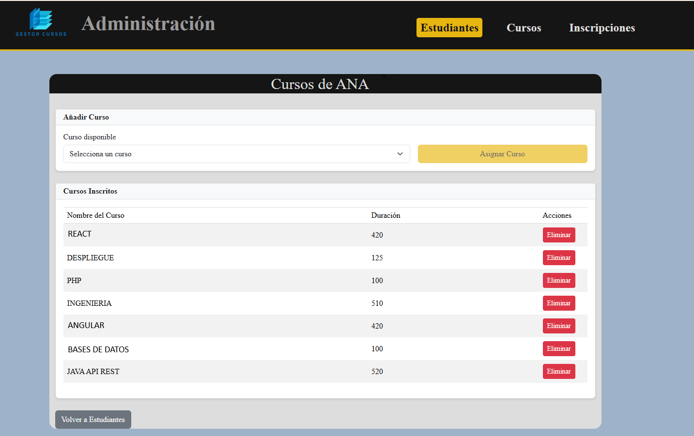

📚 PROYECTO EVALUACIÓN FINAL – GESTOR DE CURSOS

Este proyecto consiste en una aplicación full-stack (Java + Angular) para la gestión de estudiantes y cursos.
Incluye un backend en Java (Spring Boot) y un frontend en Angular.

🚀 TECNOLOGÍAS UTILIZADAS

Frontend:
- Angular
- Bootstrap
- TypeScript
- HTML / CSS

Backend:
- Java (Spring Boot)
- Maven
- JPA / Hibernate
- MySQL

🗄️ REQUISITOS PREVIOS

Antes de ejecutar el proyecto, asegúrate de tener instalado:
- Node.js y npm
- Angular CLI
- MySQL Server
- Java JDK 21+
- Un IDE compatible con Java (por ejemplo, IntelliJ IDEA o Eclipse)

🛠️ CONFIGURACIÓN DE LA BASE DE DATOS

1. Crea una base de datos en MySQL con el siguiente nombre:

   CREATE DATABASE prueba_practica_final;

2. Verifica que el archivo de configuración del backend (application.properties o application.yml) apunte a esta base de datos, por ejemplo:

   spring.datasource.url=jdbc:mysql://localhost:3306/prueba_practica_final
   spring.datasource.username=root
   spring.datasource.password=tu_contraseña

🧩 EJECUCIÓN DEL PROYECTO

Backend:
1. Abre la carpeta backend en tu IDE de Java.
2. Ejecuta el proyecto Spring Boot (por ejemplo, ejecutando la clase principal con @SpringBootApplication).

El backend correrá por defecto en:
http://localhost:8080

Frontend:
1. Abre Visual Studio Code.
2. Abre la carpeta frontend.
3. En la terminal, navega hasta el subproyecto gestor-cursos:

   cd gestor-cursos

4. Instala las dependencias necesarias:

   npm install

5. Inicia el proyecto Angular:

   npm start

El frontend correrá por defecto en:
http://localhost:4200

🌐 PUERTOS UTILIZADOS

Servicio     | Puerto | URL Base
--------------|--------|-----------------------
Backend (API) | 8080   | http://localhost:8080
Frontend (UI) | 4200   | http://localhost:4200

💡 NOTAS ADICIONALES

- Asegúrate de que MySQL esté en ejecución antes de iniciar el backend.
- Si cambias el puerto del backend, actualiza los endpoints configurados en el frontend.
- Puedes crear registros de prueba en la base de datos usando herramientas como DBeaver o phpMyAdmin.

👨‍💻 AUTOR

Tu Nombre Guillermo

💬 Si este proyecto te resulta útil, ¡no dudes en dejar una ⭐ en el repositorio!
